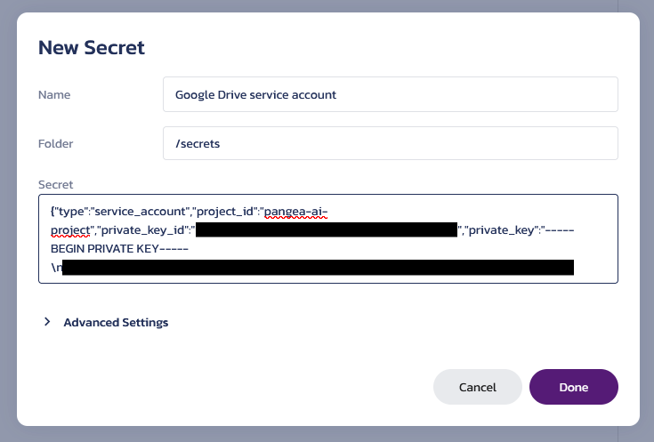

# Authenticating External Services for LangChain in Python

An example Python app demonstrating how to integrate Pangea's [Vault][] service
into a LangChain app to authenticate with external services.

## Prerequisites

- Python v3.12 or greater.
- pip v24.2 or [uv][] v0.4.24.
- A [Pangea account][Pangea signup] with AuthN and AuthZ enabled.
- An [OpenAI API key][OpenAI API keys].
- A Google Drive folder containing documents. Note down the ID of the folder
  (see [the LangChain docs][retrieve-the-google-docs] for a guide on how to get
  the ID from the URL).
- A Google Cloud project with the [Google Drive API][] enabled.
- A Google service account with the `"https://www.googleapis.com/auth/drive.readonly"`
  scope.

The Google service account's credentials will also need to be added to Vault.
This would look like:



Save the ID of the new Vault item for later.

## Setup

```shell
git clone https://github.com/pangeacyber/langchain-python-service-authn.git
cd langchain-python-service-authn
```

If using pip:

```shell
python -m venv .venv
source .venv/bin/activate
pip install .
```

Or, if using uv:

```shell
uv sync
source .venv/bin/activate
```

The sample can then be executed with:

```shell
python -m langchain_service_authn
```

## Usage

```
Usage: python -m langchain_service_authn [OPTIONS] PROMPT

Options:
  --google-drive-folder-id TEXT  The ID of the Google Drive folder to fetch
                                 documents from.  [required]
  --vault-item-id TEXT           The item ID of the Google Drive credentials
                                 in Pangea Vault.  [required]
  --vault-token SECRET           Pangea Vault API token. May also be set via
                                 the `PANGEA_VAULT_TOKEN` environment
                                 variable.  [required]
  --pangea-domain TEXT           Pangea API domain. May also be set via the
                                 `PANGEA_DOMAIN` environment variable.
                                 [default: aws.us.pangea.cloud; required]
  --model TEXT                   OpenAI model.  [default: gpt-4o-mini;
                                 required]
  --openai-api-key SECRET        OpenAI API key. May also be set via the
                                 `OPENAI_API_KEY` environment variable.
                                 [required]
  --help                         Show this message and exit.
```

For this example, we have various text documents from an Engineering department
and a Finance department in a Google Drive folder.

```
python -m langchain_service_authn --google-drive-folder-id 1Kj77... --vault-item-id pvi_... "What is the top salary in the Engineering department?"
```

```
The top salary in the Engineering department is $130,000, earned by Michael Brown, who holds the position of System Architect.
```

[Vault]: https://pangea.cloud/docs/vault/
[Pangea signup]: https://pangea.cloud/signup
[OpenAI API keys]: https://platform.openai.com/api-keys
[Google Drive API]: https://console.cloud.google.com/flows/enableapi?apiid=drive.googleapis.com
[uv]: https://docs.astral.sh/uv/
[retrieve-the-google-docs]: https://python.langchain.com/docs/integrations/retrievers/google_drive/#retrieve-the-google-docs
